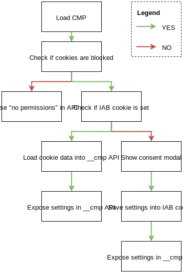
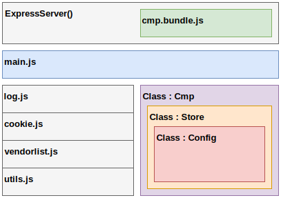

# Technical Documentation for CMP++
An IAB compliant CMP, with user privacy preserving features.

### Install

You can install simply by running the following commands:
```bash
git clone https://github.com/orbislabs/cmp.git
cd cmp
npm install
```

And then run for a development setup:

```bash
npm run dev # terminal tab 1
nodemon server.js # terminal tab 2
```

### The Flow Logic



### Minimal Required API

```javascript
showConsentTool() // returns bool
getVendorConsents([vendor_array], callback) // returns permissions for vendor list
getConsentData(null, callback) // returns a base64 encoded cookie value
ping(null, callback) // is cmp loaded? is gdpr global?
```

### App Architecture


## ConsentString SDK

Create a new instance of the main class
```javascript
new ConsentString(baseString) // take input as base64 encoded cookie value, defaults to null
```
The class instance offers up the following properties:

| Name | Type | Argument | Output Type | Output Example |
| ---- | ---- | ------- | ------------ | -------------- |
|`allowedPurposeIds` | property | `null` | `Array.<integer>` | [1,2,3,4] |
|`allowedVendorIds` | property | `null` | `Array.<integer>` | [1,2,3,4] |
|`cmpId` | property | `null` | `integer` | 7 |
|`cmpVersion` | property | `null` | `integer` | 1 |
|`consentLanguage` | property | `null` | `string` | en |
|`consentScreen` | property | `null` | `integer` | 1 |
|`vendorList` | property | `null` | `object` | {} |
|`vendorListVersion` | property | `null` | `integer` | 7 |
|`version` | property | `null` | `integer` | 1 |
|`getCmpId()` | method | `null` | `integer` | 4 |
|`getCmpVersion()` | method | `null` | `integer` | 1 |
|`getConsentLanguage()` | method | `null` | `string` | en |
|`getConsentScreen()` | method | `null` | `integer` | 5 |
|`getConsentString()` | method | `null` | `string` | BOGHWRWN62525HSGGS |
|`getPurposesAllowed()` | method | `null` | `Array.<integer>` | [1,2,3,4] |
|`getVendorListVersion()` | method | `null` | `integer` | 5 |
|`getVendorsAllowed()` | method | `null` |`Array.<integer>` | [1,2,3,4] |
|`getVersion()` | method | `null` | `integer` | 5 |
|`isPurposeAllowed(purposeId)` | method | purposeId `integer` | `boolean` | true |
|`isVendorAllowed(vendorId)` | method | vendorId `integer` | `boolean` | true |
|`setCmpId(id)` | method | id `integer` | `null` |  |
|`setCmpVersion(version)` | method | version `integer` | `null` |  |
|`setConsentLanguage(language)` | method | language `string` | `null` |  |
|`setConsentScreen(screenId)` | method | screenId `*` | `null` |  |
|`setGlobalVendorList(vendorList)` | method | vendorList `object` | `null` |  |
|`setPurposeAllowed(purposeId, value)` | method | purposeId `integer`, value `boolean`| `null` |  |
|`setPurposesAllowed(purposeIds)` | method | purposeIds `Array.<integer>`| `null` |  |
|`setVendorAllowed(vendorId, value)` | method | vendorId `integer`, value `boolean`| `null` |  |
|`setVendorsAllowed(vendorIds)` | method | vendorIds `Array.<integer>`| `null` |  |

### Internal APIs

The following are functions, to be made available internally
```javascript
readCookie(cookieName = 'euconsent')
writeCookie(cookieName = 'euconsent', value)
queryAllowedVendors([vendorArray])
updateCmpSettings(configObject, userChoices)
```

### Config
- **cmpId** = 99 (note: random for now)
- **cmpVersion** = 1
- **consentLanguage** = 'en'
- **consentScreen** = 1 (note: need to figure out what the purpose of this field is)
- **vendorListLocation** = set to a path on the server for now
- **vendorListVersion** = 7 (can be fetched from vendor list itself)
- **iabVersion** = 1.1 (the IAB spec version)
